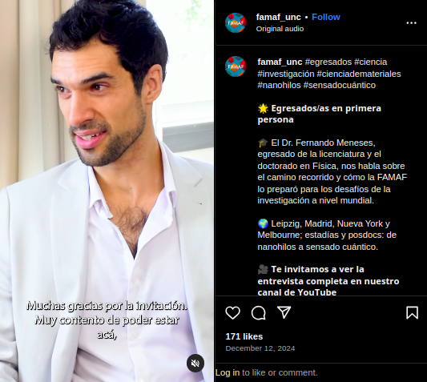

Site under construction

  
  
I'm a physicist with expertise in Artificial Intelligence, Quantum Sensing and Magnetic Nanomaterials. I've worked at the <b>University of Melbourne</b> (Australia), the <b>City College of New York</b> (USA) and the <b>National University of Córdoba</b> (Argentina), where I'm currently employed as an associate professor. In the last years, I've been focusing on combining my Machine Learning skills with my background in experimental Physics and data science.

 

# Career trajectory

## Work experience

  
  
<b>Dec 2024 - Present</b>. 
  Associate Professor. 
  <i>Topics:</i> Artificial Intelligence, Magnetism, Nanomaterials, Experimental Physics.

  
  
<b>Mar 2022 - Nov 2024</b>. 
  Post-doctoral researcher. 
  <i>Topics:</i> Artificial Intelligence, Quantum Sensing, Diamond Magnetomery, Experimental Physics.

  
  
<b>Feb 2021 - Feb 2022</b>. 
  Post-doctoral researcher. 
  <i>Topics:</i> Artificial Intelligence, Quantum Sensing, Diamond Magnetomery, Experimental Physics.

  
  
<b>Mar 2020 - Dec 2020</b>. 
  Post-doctoral researcher / Assistant professor. 
  <i>Topics:</i> Magnetism, Nanomaterials, Experimental Physics.

## Education

  
  
<b>Mar 2020</b>. Physics PhD. 
  Thesis: <i>Magnetic nanowires: sample preparation and physico-chemical properties.</i> 
  <b>Mar 2015</b>. Physics Licenciature. 
  Final project: <i>Magnetic and structural properties of Ni nanowires in porous alumina templates.</i>

# Research AI-Projects

## Artificial Intelligence assisting Quantum Noise Spectroscopy

  

    
<b>Quantum diamond magnetometry</b>, a sensing technique based on atomic defects in a diamond lattice, is a powerful tool to the <b>magnetic environment</b> of a sample and extract information about the <b>noise spectral density</b>.  In this project, we have incorporated <b>Artificial Intelligence</b> methods to train a deep learning neural network, using a large dataset comprised of simulations, and predict the noise spectrum for experimental magnetic signals. Our novel work has demonstrated an <b>improved efficiency compared to traditional approaches</b>, achieving more accurate results.

  

  

    
  

Visit the project summary: [Deep Learning applied to Spectral Imaging of Magnetic Noise](https://fertmeneses.github.io/AI-quantum-noise-spectroscopy/).

Read the full scientific article: [Toward Deep-Learning-Assisted Spectrally Resolved Imaging of Magnetic Noise](https://journals.aps.org/prapplied/abstract/10.1103/PhysRevApplied.18.024004).

## Titanic: Machine Learning from disaster

  

    
  

  

    
This project is based on the famous Kaggle competition, in which a Machine Learning algorithm must be designed to predict which passengers survived the Titanic tragedy, based on a small and incomplete dataset. I've made a deep study for this challenge, exploring many <b>feature engineering</b> possibilities and <b>AI architectures</b>. My results are above the mean performance, although there is much room for improvement, and that's why I've documented my code and reasoning in a clear way and invite the readers to contribute with comments and suggestions.

  

Visit the project summary: [Titanic - Machine Learning project](https://fertmeneses.github.io/titanic-ML-from-disaster/).

Check the original version for Kaggle: [Titanic/Kaggle - Full analysis 🕵](https://www.kaggle.com/code/fertmeneses/titanic-kaggle-full-analysis).

## Spaceship Titanic: AI to the rescue

  

    
In this Kaggle competition, in the year 2912 the Titanic Spaceship was launched, and it met a similar fate as its old predecesor in a galaxy tragedy that sent half of the passengers to an alternative dimension. There's still time to rescue them, but we must first identify these passengers from a scarce information. In this project, the goal is to use <b>Data Analysis and Machine Learning skills</b> to predict which passengers where transported to the alternative dimensions.

  

  

    
  

While I'm working in the full solution, I've segmented my work in progressive stages, starting with data analysis and continuing with the Machine Learning implementation. You can check the first two chapters, already published in Kaggle:

- [Spaceship Titanic 🏁 Getting familiar](https://www.kaggle.com/code/fertmeneses/spaceship-titanic-getting-familiar)
- [Spaceship Titanic 💡 Feature engineering](https://www.kaggle.com/code/fertmeneses/spaceship-titanic-feature-engineering)

# Coding challenges

## Open coding challenge: Bottle sets

  

    
Inspired in the challenges offered by the Turing platform, I've designed my own <b>open coding challenge to develop both programming and data analysis skills</b>. Anyone can attempt their own solution and try to pass all test cases. As in the original format, the users can attempt to reach the correct answers before 45 minutes, but they can also put the pressure aside and do it at their own pace. As a reference, I've included my own solution, explained my reasoning and broke down my code line by line.

  

  

    
  

Visit the challenge website: [Open coding challenge: Bottle sets](https://fertmeneses.github.io/coding_challenge_bottle_sets/).

# Media releases

  

    
<b>Graduates in First Person | Fernando Meneses: A Closing Circle</b>.  
    <i>Interview by FAMAF-UNC, December 2024</i>.  
    "Dr. Fernando Meneses, a graduate from FAMAF with a bachelor's and doctorate in Physics, shares his journey and explains how FAMAF prepared him for the challenges of research on a global scale." 
    Full interview: <a href="https://www.youtube.com/watch?v=mupjLnqOW6s">Youtube link</a> 
    Short summary: <a href="https://www.instagram.com/famaf_unc/reel/DDfQBQdq0Rs/">Instagram link</a>

  

  

    
  

---

  

    
<b>Virtual Lectures Series on Nanodiamond</b>.  
    <i>Program of cutting-edge nanodiamond and quantum diamond research, by Adamas Nanotechnologies, October 2024</i>. 
    Presentation topic: "Quantum Diamond Magnetometry and Machine Learning Applied to Real-Time Object Monitoring". 
    Recorded presentation: <a href="https://www.youtube.com/watch?v=5ZBcUqQFWfI">Youtube link</a>. 
    Lecture series: <a href="https://www.adamasnano.com/virtual-lectures">Adamas website</a>.

  

  

    
  

---

  

    
<b>Show us your Science</b>.  
    <i>Image competition organized by The University of Melbourne, July 2024</i>.  
    "We asked entrants for surprising, beautiful, or intriguing images of their scientific interests or activities, so we can show the extraordinary range of our research from the microscopic to the macro universe, and why it matters – not only to the image maker, but also to our communities, ecosystems, industries or governments." 
    <a href="https://science.unimelb.edu.au/engage/show-us-your-science">Link to competition winners</a>.

  

  

    
  

---

PhD thesis online: Magn
Entrevistado en nota de Cadena 3, con motivo de la primera defensa virtual de una tesis de doctorado en la Facultad de Matemática, Astronomía, Física y Compuración (FAMAF-UNC) en el marco de la pandemia COVID-19.
Link:
https://www.cadena3.com/noticia/viva-la-radio/defendio-su-tesis-de-manera-virtual-y-es-doctor-en-fisica_256904

# Scientific Publications

Stats

Google Schollar link: https://scholar.google.com/citations?user=rYzKLRsAAAAJ&hl=es

ORCID: https://orcid.org/0000-0003-3616-2928

Highlighted:

- Paper 1

- Paper 2

- Paper 3

# Gallery: my professional trajectory

Pictures

# CV and links

CV file link

Find an expert [UniMelb]

Ciencia de Materiales [UNC]

Carlos Meriles Group webpage [CCNY]

Research Gate

GitHub

LinkedIn

Kaggle