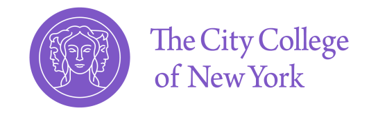
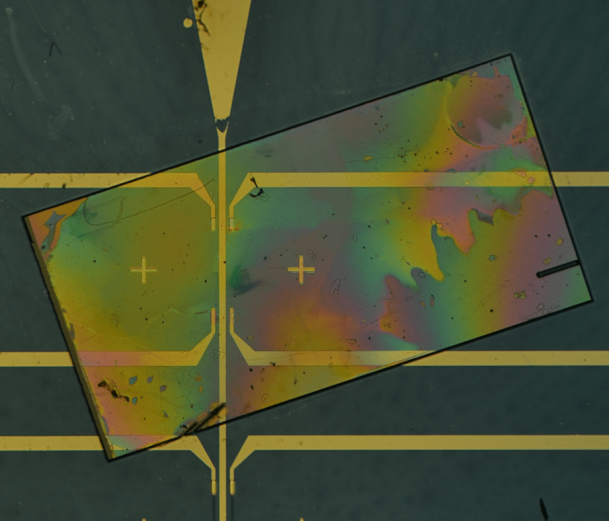
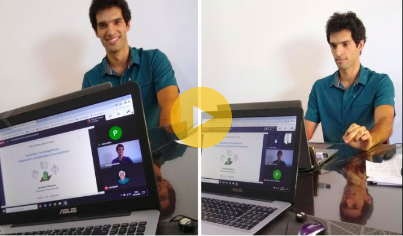

  
  
With more than 10 years of experience in <strong>Data Analysis</strong> and <strong>Machine Learning</strong>, I am a skilled professional dedicated to solving complex problems by integrating <strong>AI</strong>, <strong>statistical analysis</strong> and the <strong>scientific method</strong>. I have successfully led international teams in developing and deploying advanced solutions, including <strong>deep learning</strong> models for <strong>predictive analysis</strong> and <strong>computer vision</strong> systems for geometric analysis of 2D images.

 

# Core competencies

⚙️ <strong>Machine Learning & AI</strong>: Deep learning \| Computer vision \| Time series forecasting \| NLP \| Classical ML (scikit-learn)

💻 <strong>Programming & Tools</strong>: Python \| TensorFlow \| Pandas \| NumPy \| Scikit-learn \| OpenCV \| Matlab \| Fortran

📊 <strong>Data Analysis</strong>: Statistical modeling \| Simulations \| Hypothesis testing \| Physical modeling

📈 <strong>Visualization & BI</strong>: Matplotlib \| Seaborn \| Looker

☁️ <strong>Cloud & Big Data</strong>: Google Cloud Platform (GCP) \| BigQuery \| Dataproc \| SQL

🤝 <strong>Soft Skills</strong>: Clear communication of technical results \| Problem-solving \| Cross-functional collaboration \| Project leadership \| Project management \| International teamworking

# CV and links

 <a href="https://github.com/Fertmeneses/fertmeneses.github.io/blob/main/assets/CV_MENESES.pdf" target="_blank">[Check my CV]</a> 👈 &nbsp;&nbsp; Let's connect! &nbsp;&nbsp;  <a href="https://www.linkedin.com/in/fernando-meneses-unc/" target="_blank">&nbsp;LinkedIn</a>

View my work and skills in other platforms:

 <a href="https://github.com/Fertmeneses" target="_blank">&nbsp;GitHub</a>
&nbsp;&nbsp;|&nbsp;&nbsp;
 <a href="https://www.kaggle.com/fertmeneses" target="_blank">&nbsp;Kaggle</a>
&nbsp;&nbsp;|&nbsp;&nbsp;
 <a href="https://www.cloudskillsboost.google/public_profiles/c7b2d285-55f5-4b4c-b0f8-f66418284cc1" target="_blank">&nbsp;Google Cloud Skills</a>

# Career trajectory

## Work experience

  

  
  

  

  

    
<em>Jan 2025 - Aug 2025</em>. 
    <strong>AI Consultant – Prompt engineering and Model evaluation.</strong>   
    • Develop high-quality structured prompts and Physics problems to train and evaluate LLM models. 
    • Analyze model outputs to identify reasoning gaps and propose targeted improvements. 
    • Mentor junior consultants providing technical guidance and quality control for prompt engineering and evaluation workflows.
    
 
  

  

  
  

  

  

  
<em>Dec 2024 - Aug 2025</em>. 
  <strong>AI Research Lead – Nanotechnology Applications.</strong> 
  • Implement Deep learning solutions to analyze complex physical systems and experimental data. 
  • Apply computer vision, statistical analysis and predictive modeling in projects with industrial relevance. 
  • Lead cross-functional teams, fostering a collaborative and goal-oriented research environment. 
  • Supervise junior researchers and students, providing mentorship in data analysis, scientific communication and project execution.
  

  

  

  
  

  

  

  
<em>Mar 2022 - Nov 2024</em>. 
  <strong>ML Project Lead – Quantum Sensing Applications.</strong> 
  • Managed end-to-end ML pipelines, using ETL workflows to process both structured and unstructured data. 
  • Collaborated with interdisciplinary teams to align model outputs with physical constraints and sensor requirements. 
  • Applied Business Intelligence principles to create clear, impactful dashboards and data visualizations that supported decision-making across the team.
  

  

  

  
  

  

  

  
<em>Apr 2020 - Feb 2022</em>. 
  <strong>Data Scientist – Quantum Systems and ML Integration.</strong> 
  • Simulated synthetic datasets for training and validating machine learning models. 
  • Applied statistical analysis techniques to analyze complex experimental and simulated data. 
  • Engineered the interface between machine learning algorithms and quantum sensor hardware for seamless data ingestion.
  

  

  

  
  

  

  

  
<em>Mar 2015 - Mar 2020</em>. 
  <strong>Data Scientist – Materials Science and Nanotechnology.</strong> 
  • Conducted advanced research on materials science and nanotechnology applications, leveraging data-driven approaches to solve complex scientific problems. 
  • Performed comprehensive statistical analyses on experimental and simulation data to extract meaningful insights and validate hypotheses. 
  • Collaborated with international research teams, coordinating data sharing and aligning project objectives across multidisciplinary groups. 
  • Developed and maintained robust codebases and related tools for data processing, modeling, and visualization. 
  • Managed project timelines, resources, and deliverables to ensure successful completion of research milestones. 
  • Communicated research findings to both technical and non-technical audiences through reports, publications, and public outreach initiatives.
  

  

## Education

  

  
  

  

  

  
<strong>Mar 2020</strong>. Physics PhD. 
  Thesis: <em>Magnetic nanowires: sample preparation and physico-chemical properties.</em>  
  <strong>Mar 2015</strong>. Physics Licenciature. 
  Final project: <em>Magnetic and structural properties of Ni nanowires in porous alumina templates.</em>

  

# Research AI-Projects

## Crypto Pipeline Project

  

    
This project is about designing a whole <strong>pipeline for processing cryptocurrency information and make predictions in the future</strong>. Across 4 different stages, I have managed the various steps of the full process, starting by the <strong>Extract, Transform and Load (ETL)</strong> process, then performed <strong>data analysis and engineering</strong>, and finally built <strong>Machine Learning (ML) models</strong> that can predict the price of cryptocurrency 1 day ahead, based on the previous 7 days activity and other features.

  

  

    
  

Visit the project summary: [Crypto Pipeline Project](https://fertmeneses.github.io/Crypto-Pipeline-Project/).

## Quantum Sensing and Machine Learning applied to Object Monitoring

  

    
  

  

    
By combining <strong>quantum diamond magnetometry</strong> and <strong>machine learning algorithms</strong>, we have developed an <strong>integrated sensing platform capable of monitoring objects in real-time by measuring magnetic signals</strong>. This project exploits the advantages of magnetic sensing, a compelling alternative to traditional tracking systems like Global Positioning Systems (GPS), specially valuable in environments where GPS signals are unavailable, such as indoors, underground or underwater. <strong>Through Machine Learning analysis, we can process experimental measurements directly, bypassing the need of complex data physical models or simulations</strong>.

  

Visit the project summary: [Quantum Sensing and Machine Learning applied to Object Monitoring](https://fertmeneses.github.io/ML_QDM_Meneses_et_al/).

Read the full scientific article: <a href="https://arxiv.org/abs/2502.14683" target="_blank">Machine learning assisted tracking of magnetic objects using quantum diamond magnetometry</a>.

## Artificial Intelligence assisting Quantum Noise Spectroscopy

  

    
<strong>Quantum diamond magnetometry</strong>, a sensing technique based on atomic defects in a diamond lattice, is a powerful tool to the <strong>magnetic environment</strong> of a sample and extract information about the <strong>noise spectral density</strong>. 
     In this project, we have incorporated <strong>Artificial Intelligence</strong> methods to train a deep learning neural network, using a large dataset comprised of simulations, and predict the noise spectrum for experimental magnetic signals. Our novel work has demonstrated an <strong>improved efficiency compared to traditional approaches</strong>, achieving more accurate results.

  

  

    
  

Visit the project summary: [Deep Learning applied to Spectral Imaging of Magnetic Noise](https://fertmeneses.github.io/AI-quantum-noise-spectroscopy/).

Read the full scientific article: <a href="https://journals.aps.org/prapplied/abstract/10.1103/PhysRevApplied.18.024004" target="_blank">Toward Deep-Learning-Assisted Spectrally Resolved Imaging of Magnetic Noise</a>.

## Titanic: Machine Learning from disaster

  

    
  

  

    
This project is based on the famous <strong>Kaggle competition</strong>, in which a Machine Learning algorithm must be designed to predict which passengers survived the Titanic tragedy, based on a small and incomplete dataset. I've made a deep study for this challenge, exploring many <strong>feature engineering</strong> possibilities and <strong>AI architectures</strong>. My results are above the mean performance, although there is much room for improvement, and that's why I've documented my code and reasoning in a clear way and invite the readers to contribute with comments and suggestions.

  

Visit the project summary: [Titanic - Machine Learning project](https://fertmeneses.github.io/titanic-ML-from-disaster/).

Check the original version for Kaggle: <a href="https://www.kaggle.com/code/fertmeneses/titanic-kaggle-full-analysis" target="_blank">Titanic/Kaggle - Full analysis 🕵</a>.

## Spaceship Titanic: AI to the rescue

  

    
In this <strong>Kaggle competition</strong>, in the year 2912 the Titanic Spaceship was launched, and it met a similar fate as its old predecesor in a galaxy tragedy that sent half of the passengers to an alternative dimension. There's still time to rescue them, but we must first identify these passengers from a scarce information. In this project, the goal is to use <strong>Data Analysis and Machine Learning skills</strong> to predict which passengers where transported to the alternative dimensions.

  

  

    
  

I've segmented my work in progressive stages, starting with data analysis and continuing with the Machine Learning implementation. You can check the three chapters, already published in Kaggle:

- <a href="https://www.kaggle.com/code/fertmeneses/spaceship-titanic-getting-familiar" target="_blank">Spaceship Titanic 🏁 Getting familiar</a>
- <a href="https://www.kaggle.com/code/fertmeneses/spaceship-titanic-feature-engineering" target="_blank">Spaceship Titanic 💡 Feature engineering</a>
- <a href="https://www.kaggle.com/code/fertmeneses/spaceship-titanic-data-imputation" target="_blank"> Spaceship Titanic 🩹 Data imputation</a>

# Coding challenges

## Open coding challenge: Bottle sets

  

    
Inspired in the challenges offered by the Turing platform, I've designed my own <strong>open coding challenge to develop both programming and data analysis skills</strong>. Anyone can attempt their own solution and try to pass all test cases. As in the original format, the users can attempt to reach the correct answers before 45 minutes, but they can also put the pressure aside and do it at their own pace. As a reference, I've included my own solution, explained my reasoning and broke down my code line by line.

  

  

    
  

Visit the challenge website: [Open coding challenge: Bottle sets](https://fertmeneses.github.io/coding_challenge_bottle_sets/).

# Media releases

  

    
<strong>Graduates in First Person | Fernando Meneses: A Closing Circle</strong>.  
    <em>Interview by FAMAF-UNC, December 2024</em>.  
    "Dr. Fernando Meneses, a graduate from FAMAF with a bachelor's and doctorate in Physics, shares his journey and explains how FAMAF prepared him for the challenges of research on a global scale." 
    Full interview: <a href="https://www.youtube.com/watch?v=mupjLnqOW6s" target="_blank">Youtube link</a>. 
    Short summary: <a href="https://www.instagram.com/famaf_unc/reel/DDfQBQdq0Rs/" target="_blank">Instagram link</a>.

  

  

    
  

---

  

    
<strong>Virtual Lectures Series on Nanodiamond</strong>.  
    <em>Program of cutting-edge nanodiamond and quantum diamond research, by Adamas Nanotechnologies, October 2024</em>. 
    Presentation topic: "Quantum Diamond Magnetometry and Machine Learning Applied to Real-Time Object Monitoring". 
    Recorded presentation: <a href="https://www.youtube.com/watch?v=5ZBcUqQFWfI" target="_blank">Youtube link</a>. 
    Lecture series: <a href="https://www.adamasnano.com/virtual-lectures" target="_blank">Adamas website</a>.

  

  

    
  

---

  

    
<strong>Show us your Science</strong>.  
    <em>Image competition organized by The University of Melbourne, July 2024</em>.  
    "We asked entrants for surprising, beautiful, or intriguing images of their scientific interests or activities, so we can show the extraordinary range of our research from the microscopic to the macro universe, and why it matters – not only to the image maker, but also to our communities, ecosystems, industries or governments." 
    <a href="https://science.unimelb.edu.au/engage/show-us-your-science" target="_blank">Link to competition winners</a>.

  

  

    
  

---

  

    
<strong>News article: "He defended his thesis virtually and obtained his Physics PhD"</strong>. 
    <em>Interview published by news media Cadena 3, April 2020</em>. 
    "Due to the coronavirus pandemic, Fernando Meneses became the protagonist of the first virtual PhD thesis defense in Physics in the history of the Faculty of Mathematics, Astronomy, and Physics at the National University of Córdoba (UNC)." 
    <a href="https://www.cadena3.com/noticia/viva-la-radio/defendio-su-tesis-de-manera-virtual-y-es-doctor-en-fisica_256904" target="_blank">Link to news article</a>.

  

  

    
  

# Scientific Publications

 <a href="https://scholar.google.com/citations?user=rYzKLRsAAAAJ&hl=en" target="_blank"> Google Scholar</a>
|
 <a href="https://orcid.org/0000-0003-3616-2928" target="_blank"> ORCID</a>
|
 <a href="https://www.researchgate.net/profile/Fernando-Meneses" target="_blank"> ResearchGate</a>

Articles published in peer-reviewed journals:

- <a href="https://arxiv.org/abs/2505.13675" target="_blank"><strong>Temperature dependence of coercivity for isolated Ni nanowires unraveled by high-sensitivity micromagnetometry</strong></a>, <em>Submitted, published on arXiv</em> (2025).

- <a href="https://arxiv.org/abs/2502.14683" target="_blank"><strong>Machine learning assisted tracking of magnetic objects using quantum diamond magnetometry</strong></a>, <em>Submitted, published on arXiv</em> (2025).

- <a href="https://journals.aps.org/prb/abstract/10.1103/PhysRevB.109.064416" target="_blank"><strong>Stray magnetic field imaging of thin exfoliated iron halides flakes</strong></a>, <em>Physical Review B</em> (2024).

- <a href="https://pubs.acs.org/doi/abs/10.1021/acsnano.3c01678" target="_blank"><strong>Detection of Paramagnetic Spins with an Ultrathin van der Waals Quantum Sensor</strong></a>, <em>ACS Nano</em> (2023).

- <a href="https://www.sciencedirect.com/science/article/abs/pii/S0304885323005796" target="_blank"><strong>Effective anisotropy in Fe-Ni nanowire arrays with strong dipolar interaction</strong></a>, <em>Journal of Magnetism and Magnetic Materials</em> (2023).

- <a href="https://journals.aps.org/prapplied/abstract/10.1103/PhysRevApplied.18.024004" target="_blank"><strong>Toward Deep-Learning-Assisted Spectrally Resolved Imaging of Magnetic Noise</strong></a>, <em>Physical Review Applied</em> (2022).

- <a href="https://www.sciencedirect.com/science/article/pii/S2468217922000533" target="_blank"><strong>Nickel nanobrush platform for a magnetic field-assisted electrochemical response enhancement</strong></a>, <em>Journal of Science: Advanced Materials and Devices</em> (2022).

- <a href="https://www.sciencedirect.com/science/article/abs/pii/S0254058421013079" target="_blank"><strong>Coating of aluminum substrates with nanostructured Pd–Ni alloys by electrodeposition</strong></a>, <em>Materials Chemistry and Physics</em> (2022).

- <a href="https://www.sciencedirect.com/science/article/abs/pii/S0921510720301768" target="_blank"><strong>Enhanced in-plane magnetic anisotropy in thermally treated arrays of Co-Pt nanowires</strong></a>, <em>Materials Science and Engineering: B</em> (2020).

- <a href="https://www.researchgate.net/publication/369234523_Magnetic_and_electric_characterization_of_different_Ni_systems_comprising_cylindrical_nanowires" target="_blank"><strong>Magnetic and electric characterization of different Ni systems comprising cylindrical nanowires</strong></a>, chapter in book Advances in Nanotechnology, <em>Nova Science Publishers</em> (2020).

- <a href="https://www.sciencedirect.com/science/article/abs/pii/S1567173918301822" target="_blank"><strong>Temperature dependence of the effective anisotropy in Ni nanowire arrays</strong></a>, <em>Current Applied Physics</em> (2018).

- <a href="https://www.sciencedirect.com/science/article/abs/pii/S0925838818324289" target="_blank"><strong>L10-FeNi ordered phase in AC electrodeposited iron-nickel biphasic nanowires</strong></a>, <em>Journal of Alloys and Compounds</em> (2018).

- <a href="https://www.scielo.br/j/rmat/a/VdqW9qyQnRrTZ5XDTJhsHYD/abstract/?lang=en" target="_blank"><strong>Influence of the porosity on the magnetic properties of Ni nanowires arrays</strong></a>, <em>Matéria (Rio de Janeiro)</em> (2015).

PhD thesis:

- <a href="https://drive.google.com/drive/folders/14G7YtKs9L1--VpNOOlIMveMVX2rnMpoY?usp=sharing" target="_blank"><strong>Magnetic nanowires: sample preparation and physico-chemical properties</strong></a>, directed by Prof. Paula Bercoff, <em>National University of Córdoba</em> (2020).

Physics Degree final project:

- <a href="https://drive.google.com/drive/folders/14G7YtKs9L1--VpNOOlIMveMVX2rnMpoY?usp=sharing" target="_blank"><strong>Magnetic and structural properties of Ni nanowires in porous alumina templates</strong></a>, directed by Prof. Paula Bercoff, <em>National University of Córdoba</em> (2015).

# Image Gallery

## National University of Córdoba

  
  
  

## The University of Melbourne

  
  
  

## City College of New York

  
  

 

-----

[🔼 Back to top](#cv-and-links)